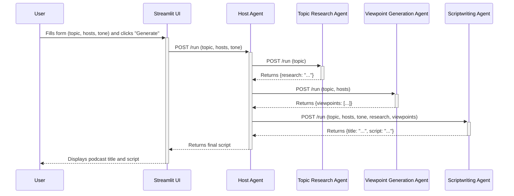

# AI-Powered Podcast Script Generator

This project is a multi-agent system that automates the creation of podcast scripts. Users can define a topic, two hosts, and a desired tone, and the AI agents will research the topic, generate distinct viewpoints for each host, and write a complete podcast script.

## Architecture

The system is built with a service-oriented architecture, where each agent is an independent FastAPI application. A Streamlit web interface provides the user with a simple form to generate the podcast script.

The agents are:

*   **Host Agent**: Orchestrates the entire process, coordinating the other agents.
*   **Topic Research Agent**: Researches the user-defined topic to gather relevant information.
*   **Viewpoint Generation Agent**: Creates two distinct viewpoints on the topic, one for each host.
*   **Scriptwriting Agent**: Writes the final podcast script, incorporating the research and viewpoints.

```mermaid
graph TD
    subgraph "Podcast Generation System"
        direction LR
        
        UI[Streamlit UI]
        
        subgraph "Multi-Agent System (HTTP/JSON APIs)"
            direction TB
            
            HA[Host Agent <br> (FastAPI)]
            
            subgraph "Specialized Agents"
                direction LR
                TRA[Topic Research Agent <br> (FastAPI)]
                VGA[Viewpoint Generation Agent <br> (FastAPI)]
                SWA[Scriptwriting Agent <br> (FastAPI)]
            end
        end
        
        UI -- "POST /run" --> HA
        HA -- "POST /run" --> TRA
        HA -- "POST /run" --> VGA
        HA -- "POST /run" --> SWA
    end

    style UI fill:#cde4ff
    style HA fill:#ffb3ba
    style TRA fill:#baffc9
    style VGA fill:#baffc9
    style SWA fill:#baffc9
```

## File Structure

```
podcast_creator_mas/
├── agents/
│   ├── host_agent/
│   │   ├── .well-known/
│   │   │   └── agent.json
│   │   ├── __init__.py
│   │   ├── __main__.py
│   │   ├── agent.py
│   │   └── task_manager.py
│   ├── topic_research_agent/
│   │   ├── .well-known/
│   │   │   └── agent.json
│   │   ├── __init__.py
│   │   ├── __main__.py
│   │   ├── agent.py
│   │   └── task_manager.py
│   ├── viewpoint_generation_agent/
│   │   ├── .well-known/
│   │   │   └── agent.json
│   │   ├── __init__.py
│   │   ├── __main__.py
│   │   ├── agent.py
│   │   └── task_manager.py
│   └── scriptwriting_agent/
│       ├── .well-known/
│       │   └── agent.json
│       ├── __init__.py
│       ├── __main__.py
│       ├── agent.py
│       └── task_manager.py
├── common/
│   ├── __init__.py
│   ├── a2a_client.py
│   └── a2a_server.py
├── shared/
│   ├── __init__.py
│   └── schemas.py
├── .gitignore
├── podcast_ui.py
├── README.md
└── requirements.txt
```

## How it Works

1.  The user fills out the form in the Streamlit UI and submits it.
2.  The UI sends a request to the **Host Agent**.
3.  The **Host Agent** calls the **Topic Research Agent** to gather information.
4.  The **Host Agent** then calls the **Viewpoint Generation Agent** to create two opposing viewpoints.
5.  Finally, the **Host Agent** calls the **Scriptwriting Agent**, providing the research and viewpoints, to generate the final script.
6.  The script is returned to the UI and displayed to the user.



## Getting Started

### Prerequisites

*   Python 3.7+
*   An API key from a supported LLM provider (e.g., Gemini). You can port this to Vertex AI also. 

### Installation

1.  Clone the repository:
    ```bash
    git clone https://github.com/your-username/your-repository.git
    cd your-repository
    ```
2.  Install the dependencies:
    ```bash
    pip install -r requirements.txt
    ```
3.  Create a `.env` file in the root directory and add your API key:
    ```
    GEMINI_API_KEY=your_api_key
    ```

## Running the Project

To run the project, you need to start each agent and the Streamlit UI in separate terminal windows.

1.  **Start the Host Agent:**
    ```bash
    uvicorn agents.host_agent.__main__:app --port 8000 
    ```
2.  **Start the Topic Research Agent:**
    ```bash
    uvicorn agents.topic_research_agent.__main__:app --port 8001
    ```
3.  **Start the Viewpoint Generation Agent:**
    ```bash
    uvicorn agents.viewpoint_generation_agent.__main__:app --port 8002
    ```
4.  **Start the Scriptwriting Agent:**
    ```bash
    uvicorn agents.scriptwriting_agent.__main__:app --port 8003
    ```
5.  **Run the Streamlit UI:**
    ```bash
    streamlit run podcast_ui.py
    ```

Once all the services are running, you can access the UI in your browser at `http://localhost:8501`.